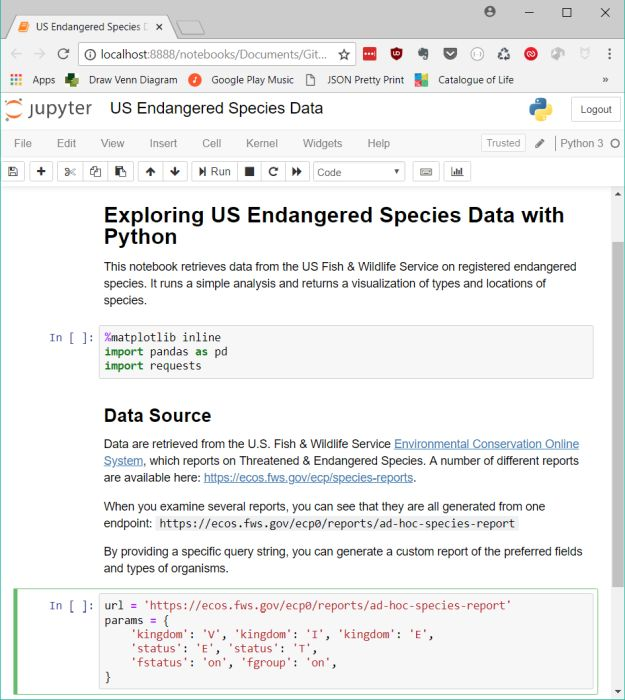
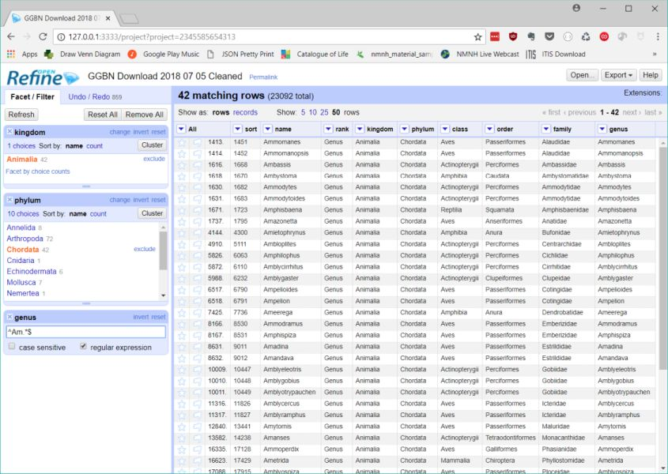

# Exploring Endangered Species Data with Python {data-background-image="img/grey-crowned-cranes.jpeg"}

## Exploring Endangered Species Data with Python ##

:::::::::::::: {.columns}
::: {.column width="25%"}

:::
::: {.column width="75%"}
**Amanda Devine**

Data Wrangler, Global Genome Initiative

27 July 2018

<small>Girls Who Code Summer Immersion Program in Washington DC field trip to the Smithsonian National Museum of Natural History</small>

<small>Slides and Jupyter notebook available at [https://github.com/amdevine/gwc-endangered-species](https://github.com/amdevine/gwc-endangered-species)</small>
:::
::::::::::::::

# About Me {data-background-image="img/giant-panda.jpeg"}

## Bio ##

:::::::::::::: {.columns}
::: {.column width="70%"}
Winston Churchill High School (go Bulldogs!)

Dartmouth College (BA in Biology (Ecology) and Neuroscience

Lab technician (dermatology, infectious disease, coral reefs)

Data wrangler for the Global Genome Initiative
:::
::: {.column width="30%"}

:::
::::::::::::::

## Global Genome Initiative (GGI) ##

:::::::::::::: {.columns}
::: {.column width="30%"}

:::
::: {.column width="70%"}
Smithsonian initiative

Collect all of life on Earth

Preserve in cryorepositories for genomic research

Sample data recorded in the [Global Genome Biodiversity Network (GGBN) Data Portal](http://data.ggbn.org/ggbn_portal/)
:::
::::::::::::::

# Data Wrangling {data-background-image="img/whale-shark.jpg"}

## What is Data Wrangling? ##

:::::::::::::: {.columns}
::: {.column width="30%"}

:::
::: {.column width="70%"}

Per [Wikipedia](https://en.wikipedia.org/wiki/Data_wrangling): *Transforming and mapping data from one raw data form into another format with the intent of making it [useful] for a variety of downstream purposes, such as analytics.*

My favorite tools:

- Scripting languages: Python, R, VBA
- Applications: [OpenRefine](http://openrefine.org/), [Jupyter Notebook](http://jupyter.org/), Excel, [Pandoc](http://pandoc.org/MANUAL.html)
- Version control: GitHub

:::
::::::::::::::

## Jupyter Notebook ##

:::::::::::::: {.columns}
::: {.column width="70%"}
Document that contains executable Python code and Markdown-formatted text

Good for running self-contained analyses

Easily share with others

**[IRkernel](https://irkernel.github.io/)**: Run notebooks with R instead of Python

**[nbviewer](https://nbviewer.jupyter.org/)**: Converts notebooks to shareable HTML documents

**[RISE](https://github.com/damianavila/RISE)**: Run a Jupyter notebook as a slide show
:::
::: {.column width="30%"}

:::
::::::::::::::

---

## OpenRefine ##

:::::::::::::: {.columns}
::: {.column width="60%"}

:::
::: {.column width="40%"}

Powerful tool for cleaning messy data

Complex filtering, sorting, and grouping

Mass editing records

Special language ([GREL](https://github.com/OpenRefine/OpenRefine/wiki/General-Refine-Expression-Language)) to filter and edit data with formulas

:::
::::::::::::::

---

## R ##

Programming language developed for statistics

Powerful at data manipulation

More intuitive than Python when working with data? ¯\\_(ツ)_/¯

**[RStudio](https://www.rstudio.com/)**: popular R development software

**[Shiny](https://shiny.rstudio.com/)**: R library, easily develop web apps to vizualize data

---

# Endangered Species Data {data-background-image="img/golden-toad.jpg"}

## Environmental Conservation Online System (ECOS)

U.S. Fish & Wildlife Service

Keeps track of species listed as Endangered or Threatened

See Jupyter Notebook containing exploratory analysis: [https://github.com/amdevine/gwc-endangered-species/blob/master/US%20Endangered%20Species%20Data.ipynb](https://github.com/amdevine/gwc-endangered-species/blob/master/US%20Endangered%20Species%20Data.ipynb)

# Thanks! {data-background-image="img/rafflesia.jpg"}

## Resources: Working with Data in Python ##

- **Automate the Boring Stuff with Python**. [https://automatetheboringstuff.com/](https://automatetheboringstuff.com/)

- **Python Data Science Handbook**. [https://jakevdp.github.io/PythonDataScienceHandbook/](https://jakevdp.github.io/PythonDataScienceHandbook/)

- Coursera: **Using Python to Access Web Data**. [https://www.coursera.org/learn/python-network-data](https://www.coursera.org/learn/python-network-data) (Can choose to audit the course for free.)

- Coursera: **Using Databases with Python**. [https://www.coursera.org/learn/python-databases](https://www.coursera.org/learn/python-databases) (Can choose to audit the course for free.)

## Resources: Coding Groups and Organizations ##

- **Women Who Code DC**. Meetup group for female-identifying coders in the Washington, DC area. Covers many different tech-related topics, frequent meetups. [https://www.meetup.com/Women-Who-Code-DC/](https://www.meetup.com/Women-Who-Code-DC/)

- **Hear Me Code**. Organization that offers beginner coding lessons for women in the Washington, DC area. Also has an excellent Google group that emails out about a lot of professional opportunities. [https://hearmecode.com/](https://hearmecode.com/)

- **Data Carpentry**. National organization that offers workshops on data wrangling. The website contains workshop materials if you can't attend a workshop in person. [https://datacarpentry.org/](https://datacarpentry.org/)

## Image Credits ##
<small>

**Title Slide**: Grey Crowned Cranes. Image from Pexels, CC0 License. [https://www.pexels.com/photo/nature-bird-love-heart-45853/](https://www.pexels.com/photo/nature-bird-love-heart-45853/)

**About Me**: Giant Panda. Photo by Cesar Aguilar from Pexels, Pexels License. [https://www.pexels.com/photo/panda-1123765/](https://www.pexels.com/photo/panda-1123765/)

**Bio**: Personal photo.

**Global Genome Initative**: Tissue samples in the NMNH Biorepository. Photo by Adrian Van Allen, 2015.

**Data Wrangling**: Whale shark at the Georgia Aquarium. Photo by Zac Wolf; CC BY-SA 2.5, https://commons.wikimedia.org/w/index.php?curid=3511009

**Data Wrangling**: Wonder Woman: Wonder Woman with Lasso. Image from AllPosters. [https://www.allposters.ca/-sp/Wonder-Woman-Wonder-Woman-with-Lasso-posters_i13190262_.htm](https://www.allposters.ca/-sp/Wonder-Woman-Wonder-Woman-with-Lasso-posters_i13190262_.htm)

**Endangered Species Data**: Bufo periglenes (Golden toad). Photo by Charles H. Smith. Retrieved from Wikipedia: [https://commons.wikimedia.org/wiki/File:Bufo_periglenes1.jpg](https://commons.wikimedia.org/wiki/File:Bufo_periglenes1.jpg)

**Thanks**: Rafflesia arnoldii. Image from lazypenguins.com, blog post "15 strangely beautiful flowers". [https://lazypenguins.com/15-strangely-beautiful-flowers/](https://lazypenguins.com/15-strangely-beautiful-flowers/)

**Thanks**: Joes Apartment Cockroach GIF. Image from GIPHY. [https://giphy.com/gifs/scarface-when-mtv-was-worth-watching-joes-apartment-CbY83hpLkcrZe](https://giphy.com/gifs/scarface-when-mtv-was-worth-watching-joes-apartment-CbY83hpLkcrZe)

</small>

